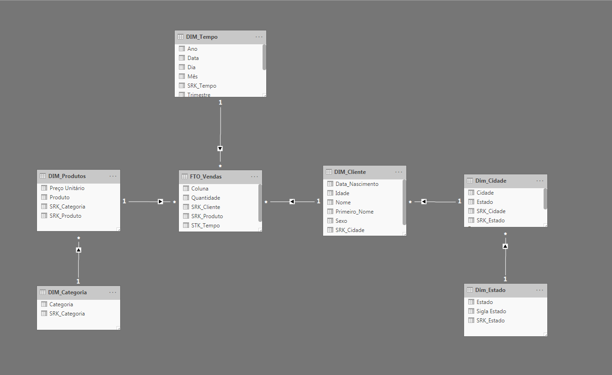

<h1 align="center"><b>
TECHNICAL TEST - HYPERCLOUD </b>
</h1>

 
O teste está estruturado em 2 etapas: 

<il>
<li>Teste Teórico</li>
<li>Teste Prático</li>
</il>

Cada etapa dos testes foram realizadas em sequencia, conforme respostas abaixo

Para acessar o dashboard criado para este desafio, basta realizar o download do arquivo <em>Relatório Hypercloud (Livraria).pbi</em> e ativar os botões de Drill Down nos tres Mapas (<em>Abas: Resumo Geral, Vendas e Clientes</em>) e também no Gráfico de Area (<em>Aba Vendas</em>)

 ---
 <h2 align="center"> <b> INDICE </b> </h2>

- <a href="#c1">TESTE TEÓRICO</a>
- <a href="#c2">ITENS VISUAIS 1 E 1.1</a>
- <a href="#c3">TESTE PRÁTICO PBI</a>

 ---

<h3 id="c1" align="center"><b> TESTE TEÓRICO </b> </h3>

<a href="#">Topo</a> &nbsp | &nbsp    <a href="#c2">Próximo</a> 

<b>
1) Para você, o que significa Business Inteligence?</b>

Business Inteligence - BI 

O Business Inteligence é um conjunto de conceitos, processos e tecnologias, que são utilizados para a tomada de decisões. Basicamente o BI é um conjunto de técnicas de inteligência empresarial, que visa otimizar as falhas e auxiliar na interpretação e análise de dados.

<b>
2) Cite duas ferramentas de ETL</b>

Informática PowerCenter, IBM InfoSphere DataStage

<b>
3) Cite três ferramentas de apresentação de Dados</b>

PowerBI, Tableau e Qlik Sense

<b>
4) O que é uma Tabela Fato e o que é uma Tabela Dimensão?</b>

Tabela Fato - É a tabela onde armazenam as métricas e as foreign keys. A métrica é utilizada para mensurar/quantificar algo, já a foreign key é chave utilizada para relacionar os dados entre as tabelas fato e dimensão.

Tabela Dimensão - É a tabela que possui o detalhamento especifico de cada dimensão, podendo conter uma ou mais chaves identificadoras. A tabela dimensão descreve as entidades do negócio/item que você irá modelar.

<b>
5) Quais tipos de modelagens são as mais utilizadas em um projeto de BI?</b>

Star Schema e Snow Floke

<b>
6) O que significa Surrogate Key?</b>

Surrogate Key = Chave Artificial Auto-Incremental.

A surrogate key é o campo de Primary Key da tabela dimensão, utilizado para conectar a mesma à tabela fato. Na tabela fato ela será uma Foreign Key que é utilizada para relacionar os dados entre as tabelas. Já na tabela dimensão ela será a Primary Key.

<b>
7) Explique a diferença entre relacionamento 1 para 1 e 1 para N?</b>

1:1 - No relacionamento 1:1, um item de uma entidade só poder se relacionar com um elemento de outra entidade. Ex. (Tendo duas entidades "Clientes" e "Endereço", um cliente só poderá possuir um endereço, e também, um endereço só pode estar relacionado à um cliente.

1:N - No relacionamento 1:N, um item de uma entidade pode se relacionar com vários outros itens de outra entidade. Ex. (Uma departamento possui vários funcionários, mas, um funcionário só é vinculado a um departamento).

<b>
8) O que significa Drill Down / Drill Up?</b>

O drill-down é um conceito aplicado quando saimos de um nivel mais alto de uma hierarquia e buscamos informações mais detalhadas nos niveis inferiores, já o drill-up é inverso do conceito de drill-down.

 ---
<h4 id="c2" align="center"> ITENS VISUAIS 1 E 1.1</h4>

<a href="#">Topo</a> &nbsp | &nbsp    <a href="#c1">Anterior</a>  &nbsp | &nbsp <a href="#c3">Próximo</a>  

<b>Item 1</b> - Faça um Desenho da modelagem deste DataWarehouse relacionando as tabelas.

<b>Item 1.1</b> - Qual a modelagem projetada?

 MODELAGEM: <b>SNOW FLOKE</b>

 ---
<h3 id="c3" align="center"><b> TESTE PRÁTICO</b></h3>

<a href="#">Topo</a> &nbsp | &nbsp    <a href="#c2">Anterior</a> 

Para o teste prático, foi solicitada a criação de um dashboard no Power BI contendo as seguintes análises visuais: 

<ol>
<li><b>Produtos mais vendidos por quantidade</b> --> <i>ABA PRODUTOS</i></li>
<li><b>Gráfico de clientes que mais compraram por quantidade (top 5)</b>--> <i>ABA RESUMO GERAL</i></li>
<li><b>Gráfico de clientes que mais compraram por valor</b>--> <i>ABA RESUMO GERAL</i></li></li>
<li><b>Timeline de quantidade de vendas por mes e ano</b>--> <i>ABA VENDAS</i></li></li>
<li><b>Gráfico de vendas por Estado com Drill Down no Município</b>--> <i>ABA VENDAS</i></li></li>
<li><b>Categoria menos vendida (top 1)</b>--> <i>ABA PRODUTOS</i></li></li>

